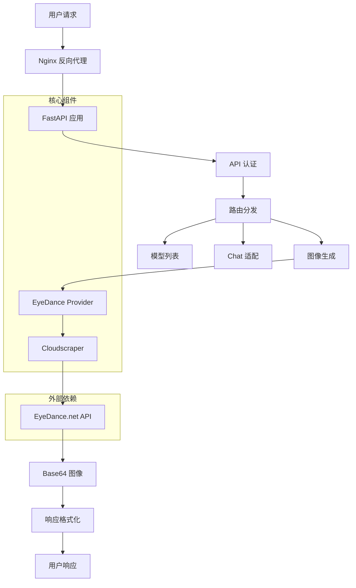
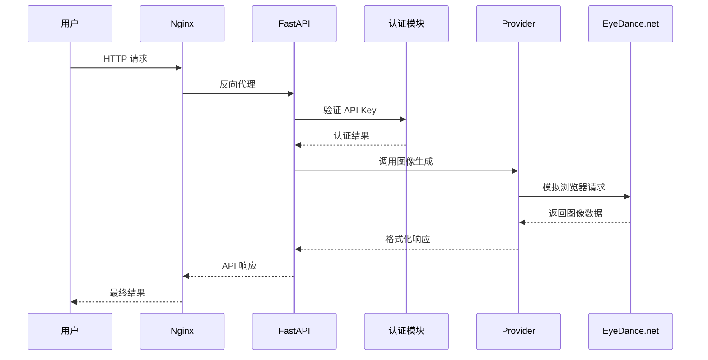

# 👁️💃 EyeDance-2API: 你的个人 AI 绘画魔坊 (v2.1)


> "我们不是在编写代码，我们是在铸造通往想象世界的桥梁。每一行指令，都是对创造力的一次致敬。"

欢迎来到 `eyedance-2api` 的世界！🌍✨ 这不仅仅是一个项目，它是一个理念的实践：**将尖端但分散的 AI 绘画能力，聚合、封装，并以最优雅、最标准的方式，赋予每一位热爱创造的人。**

我们相信，技术的价值在于分享和赋能。`eyedance-2api` 将 `eyedance.net` 网站强大的图像生成能力，转换成了兼容 OpenAI 格式的标准 API。这意味着你可以将它无缝对接到任何支持 OpenAI 接口的应用程序、脚本或工作流中！

**➡️ 前往我们的 GitHub 仓库，点亮一颗 Star ⭐，加入这场创造之旅！** [GitHub Repository](https://github.com/lzA6/eyedance-2api)

---

## 📂 项目架构概览



### 项目文件结构

```
eyedance-2api/
├── 🐋 Docker 相关文件
│   ├── Dockerfile              # 容器构建配置
│   └── docker-compose.yml      # 多服务编排配置
├── ⚙️ 配置文件
│   ├── .env                    # 环境变量（生产环境）
│   ├── .env.example            # 环境变量模板
│   └── nginx.conf              # Web 服务器配置
├── 🚀 应用核心
│   ├── main.py                 # FastAPI 应用入口
│   ├── requirements.txt        # Python 依赖
│   └── app/                    # 应用模块
│       ├── core/
│       │   └── config.py       # 配置管理
│       ├── providers/
│       │   ├── base_provider.py    # 提供者基类
│       │   └── eyedance_provider.py # EyeDance 实现
│       └── utils/
│           └── oss_uploader.py # 工具函数
├── 🌐 前端界面
│   └── static/
│       ├── index.html          # 主页面
│       ├── style.css           # 样式文件
│       └── script.js           # 交互逻辑
└── 📚 文档
    └── README.md               # 项目说明
```

---

## 🚀 快速开始

### 前提条件

- 安装 [Docker](https://www.docker.com/products/docker-desktop/) 和 Docker Compose
- 基本的命令行操作知识

### 三步部署

**1. 获取项目代码**

```bash
git clone https://github.com/lzA6/eyedance-2api.git
cd eyedance-2api
```

**2. 配置环境变量**

```bash
# 复制环境配置模板
cp .env.example .env

# 编辑配置文件，设置你的安全密钥
nano .env
```

配置示例：
```ini
# API 主密钥 - 请修改为复杂的密码
API_MASTER_KEY=your-super-secure-password-here

# 服务端口
NGINX_PORT=8089

# 重试配置
MAX_RETRIES=3
RETRY_DELAY=2
```

**3. 启动服务**

```bash
docker-compose up -d
```

### 验证部署

服务启动后，访问以下地址：

- **API 服务**: `http://localhost:8089`
- **Web 测试界面**: `http://localhost:8089/`

在 Web 界面中输入你设置的 `API_MASTER_KEY` 即可开始测试。

---

## 🏗️ 架构设计

### 核心架构



### 技术栈详解

| 技术组件 | 版本/选择 | 职责描述 | 关键特性 |
|---------|-----------|----------|----------|
| **FastAPI** | 0.104+ | API 框架 | 异步支持、自动文档、类型提示 |
| **Uvicorn** | 0.24+ | ASGI 服务器 | 高性能、轻量级 |
| **Cloudscraper** | 1.2.7+ | 反爬虫绕过 | Cloudflare 挑战处理 |
| **Pydantic** | 2.4+ | 数据验证 | 类型安全、配置管理 |
| **Docker** | 20.10+ | 容器化 | 环境隔离、一键部署 |
| **Nginx** | 1.24+ | 反向代理 | 负载均衡、静态文件服务 |

### 设计模式

1. **提供者模式 (Provider Pattern)**
   - 抽象基础接口 (`BaseProvider`)
   - 具体实现 (`EyeDanceProvider`)
   - 易于扩展新的 AI 绘画服务

2. **依赖注入 (Dependency Injection)**
   - FastAPI 的 Depends 机制
   - 配置集中管理
   - 易于测试和维护

3. **适配器模式 (Adapter Pattern)**
   - 将 EyeDance API 适配为 OpenAI 格式
   - 统一接口标准

---

## 🔧 核心功能

### 1. 图像生成 API

**端点**: `POST /v1/images/generations`

**请求示例**:
```json
{
  "model": "Flux-Krea",
  "prompt": "赛博朋克城市夜景，霓虹灯光，未来感",
  "n": 4,
  "size": "1024x1024"
}
```

**响应格式**:
```json
{
  "created": 1699284061,
  "data": [
    {
      "url": "data:image/png;base64,..."
    }
  ]
}
```

### 2. Chat 兼容接口

**端点**: `POST /v1/chat/completions`

支持将图像生成请求包装为聊天响应，兼容 OpenAI Chat 格式。

### 3. 模型列表

**端点**: `GET /v1/models`

返回支持的模型列表，便于客户端动态选择。

### 4. Web 测试界面

内置直观的 Web 界面，支持：
- 实时图像生成测试
- 多模型选择
- 批量生成预览
- API 密钥管理

---

## ⚡ 性能特性

### 并发处理

```python
# 核心并发代码示例
async def generate_images_concurrently(self, prompt: str, n: int = 1) -> List[str]:
    tasks = [self._generate_single(prompt) for _ in range(n)]
    results = await asyncio.gather(*tasks, return_exceptions=True)
    return [r for r in results if isinstance(r, str)]
```

### 请求优化

- **连接池复用**: 使用 aiohttp 连接池
- **异步 I/O**: 非阻塞网络请求
- **智能重试**: 指数退避重试机制
- **缓存策略**: 可配置的响应缓存

### 资源管理

```yaml
# Docker 资源限制
deploy:
  resources:
    limits:
      memory: 1G
      cpus: '1.0'
    reservations:
      memory: 512M
      cpus: '0.5'
```

---

## 🔒 安全设计

### 认证机制

```python
async def verify_api_key(
    authorization: str = Header(...),
    settings: AppSettings = Depends(get_settings)
) -> bool:
    """验证 API 密钥"""
    if not authorization.startswith("Bearer "):
        raise HTTPException(status_code=401, detail="Invalid authorization header")
    
    token = authorization[7:]
    if not secrets.compare_digest(token, settings.api_master_key):
        raise HTTPException(status_code=401, detail="Invalid API key")
    
    return True
```

### 安全特性

- **API 密钥认证**: Bearer Token 验证
- **请求限制**: Nginx 层限流配置
- **输入验证**: Pydantic 数据校验
- **错误处理**: 安全的异常信息返回

---

## 🛠️ 配置详解

### 环境变量

| 变量名 | 默认值 | 描述 |
|--------|---------|------|
| `API_MASTER_KEY` | - | API 主密钥（必需） |
| `NGINX_PORT` | 8089 | 服务暴露端口 |
| `MAX_RETRIES` | 3 | 最大重试次数 |
| `RETRY_DELAY` | 2 | 重试延迟（秒） |
| `LOG_LEVEL` | INFO | 日志级别 |

### 模型配置

```python
KNOWN_MODELS = [
    "Flux-Krea",
    "Flux-Realism",
    "SDXL-Hyper",
    # 更多模型...
]
```

---

## 🚨 故障排除

### 常见问题

**1. 端口冲突**
```bash
# 检查端口占用
netstat -tulpn | grep 8089

# 修改端口配置
# 在 .env 文件中修改 NGINX_PORT
```

**2. 容器启动失败**
```bash
# 查看容器日志
docker-compose logs app

# 重新构建镜像
docker-compose build --no-cache
```

**3. API 认证失败**
- 检查 `API_MASTER_KEY` 配置
- 验证请求头格式：`Authorization: Bearer your-key`

### 日志分析

```bash
# 实时查看日志
docker-compose logs -f app

# 查看特定服务日志
docker-compose logs nginx
```

---

## 📈 监控与维护

### 健康检查

```yaml
# Docker Compose 健康检查
healthcheck:
  test: ["CMD", "curl", "-f", "http://localhost:8000/health"]
  interval: 30s
  timeout: 10s
  retries: 3
```

### 性能监控

建议集成：
- **Prometheus**: 指标收集
- **Grafana**: 数据可视化
- **Sentry**: 错误追踪

---

## 🔮 未来发展

### 短期规划 (v2.2)

1. **多提供者支持**
   - 集成 PixAI、SeaArt 等平台
   - 插件化架构设计

2. **增强认证**
   - JWT Token 支持
   - 多用户 API 密钥管理

3. **功能扩展**
   - 图像放大 (Upscaling)
   - 图生图 (img2img) 支持

### 长期愿景 (v3.0)

1. **分布式架构**
   - 任务队列 (Celery + Redis)
   - 水平扩展支持

2. **高级特性**
   - WebSocket 实时进度
   - 批量任务处理
   - 历史记录管理

3. **企业功能**
   - 使用量统计
   - 计费系统
   - 团队协作

---

## 🤝 贡献指南

我们欢迎各种形式的贡献！

### 开发环境搭建

```bash
# 1. 克隆项目
git clone https://github.com/lzA6/eyedance-2api.git

# 2. 创建虚拟环境
python -m venv venv
source venv/bin/activate  # Linux/Mac
# venv\Scripts\activate  # Windows

# 3. 安装依赖
pip install -r requirements.txt

# 4. 开发模式运行
uvicorn main:app --reload --host 0.0.0.0 --port 8000
```

### 代码规范

- 使用 Black 代码格式化
- 遵循 PEP 8 规范
- 添加类型注解
- 编写单元测试

### 提交 Pull Request

1. Fork 本仓库
2. 创建特性分支 (`git checkout -b feature/AmazingFeature`)
3. 提交更改 (`git commit -m 'Add some AmazingFeature'`)
4. 推送到分支 (`git push origin feature/AmazingFeature`)
5. 开启 Pull Request

---

## 📄 开源协议

本项目采用 **Apache 2.0** 开源协议。

**简单概括**：
- ✅ 允许商业使用
- ✅ 允许修改和分发
- ✅ 允许专利使用
- 📝 要求保留版权声明
- ⚠️ 不提供责任担保

查看完整的 [Apache 2.0 协议内容](https://opensource.org/licenses/Apache-2.0)

---

## ❓ 常见问答

**Q: 这个项目是官方的吗？**  
A: 不是，这是一个社区驱动的开源项目，与 EyeDance.net 无官方关联。

**Q: 是否需要付费？**  
A: 本项目完全免费，但请注意上游服务可能有使用限制。

**Q: 支持商业使用吗？**  
A: 可以，但请遵守 Apache 2.0 协议并自行承担风险。

**Q: 如何报告安全问题？**  
A: 请通过 GitHub Issues 或直接联系维护者。

---

## 🌟 支持我们

如果这个项目对你有所帮助，请考虑：

1. ⭐ **Star 这个仓库**
2. 🐛 **报告 Bug 或提出建议**
3. 💻 **提交代码贡献**
4. 📢 **分享给更多开发者**

**让我们一起，用代码让想象力自由飞翔！🚀**

--
